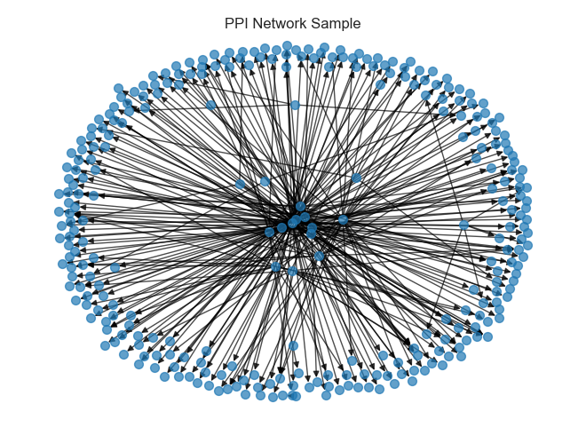
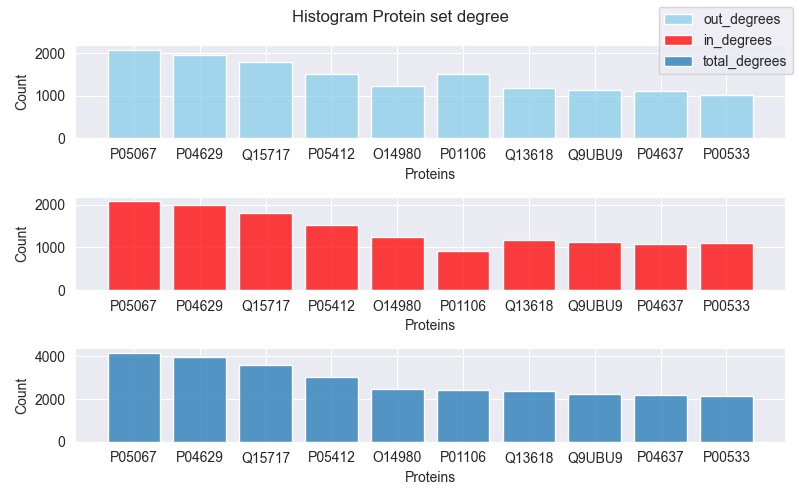
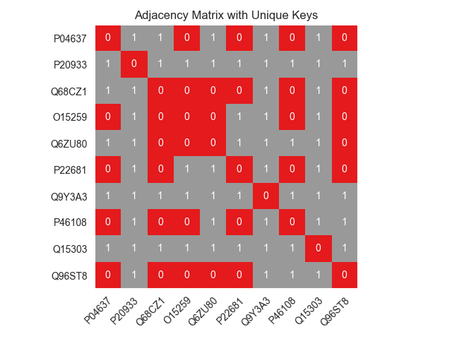
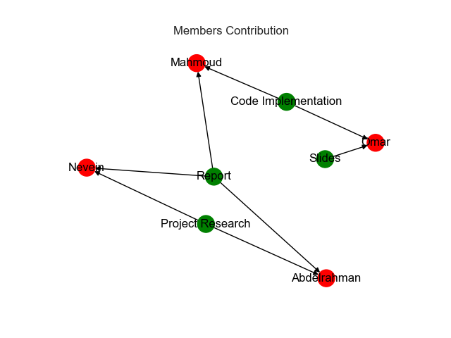

# Analyzing the Protein-Protein Interaction Network
Analyzing a biological network of protein-protein interactions __(PPIs)__ using the NetworkX python package, and construct a graph from the interactome and perform various analyses on the network, including finding the shortest path between two proteins, identifying directly connected proteins, ranking proteins based on their degree, converting UniProt IDs to gene names.
***

  - [Introduction](#introduction)
  - [Project Data](#project-data)
  - [Project Structure](#project-structure)
  - [Features](#features)
  - [Used Technologies](#used-technologies)
  - [Python Notebook](#python-notebook)
  - [Report](#report)
  - [Presentation](#presentation)
  - [Conclusion](#conclusion)
  - [Team Members](#team-members)
## Introduction
The protein-protein interaction network is crucial for understanding various biological processes, including signaling pathways and networks. Protein-protein interactions (PPIs) involve specific physical contacts between two or more protein molecules, and they play a significant role in mediating cellular processes and organismal systems. Protein interaction data provides valuable insights into the complexities of cellular function and can even aid in predicting potential therapeutics.

In this project, we aim to analyze protein-protein interactions using computational techniques. By mapping and studying the network, we can gain insights into the organization and regulation of these interactions. Our analysis will involve various tasks, such as finding the shortest path between proteins, identifying directly connected proteins, ranking proteins based on their degree, converting UniProt IDs to gene names, and converting the graph to an unweighted graph.

## Project Data
The protein-protein interaction network used in this project is obtained from the interactome file titled "PathLinker_2018_human-ppi-weighted-cap0_75.txt". You can download the interactome file from this link().

The interactome file represents a directed network of protein-protein interactions, where each interaction is described in a line with four pieces of information (columns):

1. **Tail/Source/Start Protein Node:** The UniProt ID of the tail/source/start protein node.
2. **Head/Destination/End Protein Node:** The UniProt ID of the head/destination/end protein node.
3. **Interaction Confidence:** A value ranging from 0 to 1, representing the confidence or probability of the interaction occurring. Higher values indicate a higher likelihood of the interaction.
4. **Interaction Method:** The method used to identify or detect the interaction.

- Each protein in the interactome is represented by its UniProt ID, which is a unique identifier assigned to the protein in the UniProt database. UniProt provides protein sequence and functional information and serves as a valuable resource for protein-related data.

## Project Structure
```bash
├── Data
│   ├── PathLinker_2018_human-ppi-weighted-cap0_75.txt
│   ├── acyclic_shortest_path.txt
│   └── proteins_degrees.csv
│   └── Q5MIZ7_predecessors.txt
├── images
│   ├── adjacency_matrix.png
│   ├── histogram_proteins_set.png
│   ├── output.png
│   └── shortest_paths_subnetwork.png
├── PPIs_notebook.ipynb
├── project_presentation
├── project_report.pdf
└── README.md
```

## Features

### Construct biological network :


> Construct a graph (biological network) from the interactome ["PathLinker_2018_human-ppi-weighted-cap0_75.txt"](https://github.com/Ibrahim-Youssef/localized-pathlinker/tree/master/Data) .

> By using NetworkX package we constructed a graph by taking a sample of 300 edge out of 612,516

### List the acyclic shortest path(s) between any two proteins (nodes) in a text file.
[Acyclic Shortest Path File](data/acyclic_shortest_path.txt)

>The output file provides the : 
>- Number of shortest paths.
>- Total path score.
>- All paths between the nodes.

### Draw the sub-network for acyclic shortest path(s) between two nodes:


### List all the directly connected proteins to one protein in a text file.

[Protein Predecessors File](data/Q5MIZ7_predecessors.txt)
>The output file contains :
> - The protein Degree
> - Table of all direct connections with this protein with their Edge weight.


### Draw a histogram for a set of protein’s degree and rank these proteins from the highly connected to the least in a text file.


[Proteins Degrees File](data/proteins_degrees.txt)

> The output file contains :
> - Table of ordered proteins with their degrees

### Provide a conversion map between the protein UniProt ID and its gene name. 

> You can be provided by one protein ID or a set of protein IDs, and then you need to get their corresponding gene names.

### Convert the above graph as an unweighted graph and save it using the adjacency matrix method.



## Used Technologies 

1. **NetworkX** : Powerful Python package used to create, manipulate, and analyze complex network structures. It provides a variety of algorithms and data structures to support the efficient handling of graph-based data, making it an ideal tool for the study of protein-protein interactions.

2. **UniProt** : Freely accessible database of protein sequence and functional information, many entries being derived from genome sequencing projects. It is maintained by the UniProt consortium, which consists of several European bioinformatics organizations and a foundation. The proteome identifier (UPID) is the unique identifier assigned to the protein set that constitutes the proteome. It consists of the characters 'UP' followed by 9 digits, is stable across releases, and can therefore be used to cite a UniProt proteome.

3. **Pandas** : Python's widely used data manipulation and analysis library. It provides fast, flexible, and expressive data structures designed to make working with "relational" or "labeled" data both easy and intuitive. We used it for data exploration.

4. **NumPy** : Powerful library for scientific computing in Python. It provides support for arrays, which are essential for numerical computing and data analysis, as well as mathematical functions and tools to manipulate arrays efficiently. We used it in constructing an adjacency matrix.

5. **Matplotlib** and **Seaborn** : Widely used Python data visualization libraries that allow for creating interactive, publication-quality graphs and charts. We used it for visualizing all our figures.

6. **StringIO** : From the io library allows for the creation of a virtual file-like object from a string. We used it for reading UniProt gene information from a given protein.

## Python Notebook

[Python Notebook](PPIs_notebook.ipynb)
<hr>

## Report

[Project Report](project_report.pdf)

<hr>

## Presentation

[Project Slides](project_presentation.pptx)

<hr>


## Conclusion
In conclusion, the analysis of protein-protein interactions is a critical step toward gaining a comprehensive understanding of biological systems and the formation of complex biological networks. This research paper utilized computational techniques to analyze the protein-protein interaction network, including utilizing the NetworkX python package, and UniProt database, and visualizing the results with matplotlib and seaborn. The tasks performed in this research paper provided valuable insights into the organization and regulation of protein-protein interactions, including finding the shortest path between two proteins, identifying directly connected proteins, ranking proteins based on their degree, converting UniProt IDs to gene names, and converting the graph to an unweighted graph. This study is a testament to the power of computational analysis in understanding the complexities of cellular function and predicting potential therapeutics.  

## Team Members
  |                                                             | 
  | ----------------------------------------------------------- | 
  | [Abdelrahman Ali](https://github.com/abdelrahman-ali123)    |
  | [Mahmoud Yaser](https://github.com/mahmoud1yaser)           |
  | [Omar Saad](https://github.com/Omar-Saad-ELGharbawy)        | 
  | [Nevein Mohamed](https://github.com/NeveenMohamed)          |



```
            Ibrahim Mohamed Youssef, PhD
                Assistant Professor
```
### Fall 22, SBE3031 - Advanced Topics in Medical Informatics
